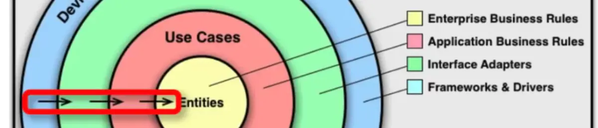

# Structuring an ExpressJS (Node.js) Projects: Best Practices and Example

When it comes to building robust and maintainable Express.js applications, a
well-organized project structure is crucial. A thoughtfully designed project
structure enhances collaboration, simplifies maintenance, and contributes to the
scalability of your application, in this guide we’ll explore the best practices
for structuring Express.js projects.

## The Clean Architecture


## The Dependency Rule

The Dependency Rule is the most important rule of the Clean Architecture: source
code dependencies can only point inwards. The innermost circle is the most
abstract and contains business logic. As you move outward, you find more
concrete and implementation-specific code.



In the illustration above, please pay attention to the arrows, the fact that
they are pointing from the outermost circle down into the innermost circle and
that they only go in one direction. The arrows represent the dependence flow,
indicating that an outer ring can depend on an inner ring but that an inner ring
cannot rely on an outer ring; this is what The Dependency Rule is all about.

For example, Entities know nothing about all the other circles, while the
Frameworks & Drivers, the outer layer, know everything about the inner rings.

In simple words, variables, functions, classes, or any other named software
entity declared in an outer circle must not be mentioned by the code in an inner
circle.

## Four Layers of Clean Architecture

There are four concentric circles in Clean Architecture that each represents
different areas of Software, which are as below:

- Entities
- Use Cases
- Interface Adapters
- Frameworks and Drivers

## Directory and File Structure


Here’s a breakdown of the common components you might find in a well-structured
Express.js project:

1. **Entities**: This layer contains enterprise-wide business rules. It is the
   innermost circle and contains the most general rules of the application.

for example, a User entity that contains the business rules for creating a user,
updating a user, and deleting a user.

```javascript
class User {
  constructor(name, email, password) {
    this.name = name;
    this.email = email;
    this.password = password;
  }

  createUser() {
    // Business logic for creating a user
  }

  updateUser() {
    // Business logic for updating a user
  }

  deleteUser() {
    // Business logic for deleting a user
  }
}
```

2. Use Cases: The Use Cases layer, which lies outside the Entities layer,
   contains login and rules related to the behavior and design of the system.

for example: Use Cases are interactions between Entities. For example, suppose
we are in our Social Media application example. In that case, we can have a Use
Case like user posts, or in the OneFood application, a customer places an order.

```javascript
// /use-cases/orders/post-order.js

export default function makePostOrder({
  ordersDb,
  orderItemsDb,
  getPromoCodeDetails,
}) {
  return async function postOrder({ body, headers, user }) {
    // Validate parameters...
    // Create order...
    // Create order items...

    return order;
  };
}
```

3. Interface Adapters: The Interface Adapters or the Adapter layer holds the
   controllers, APIs, and gateways. The Interface Adapters govern the flow of
   communication between external components and the system's back-end.

In simple words, Interface Adapters are isolating our various Use Cases from the
tools that we use.

```javascript
import {
  postOrder,
  // ...
} from "use-cases/orders";

import { postPaymentLink } from "use-cases/payments";

export default Object.freeze({
  postOrder: (httpRequest) => postOrder(httpRequest, postPaymentLink),
  // ...
});
```

The above example shows that the Interface Adapters are responsible for creating the order object that will be passed to the Use Cases layer.


for more information vitis [this post](https://merlino.agency/blog/clean-architecture-in-express-js-applications)
