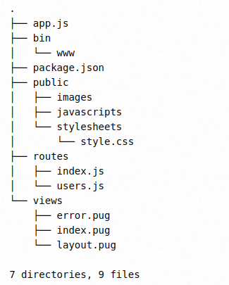

# Express practice

1. **Hello world example**

   a. Create a file called **app.js**

   b. Add the following code to the file

   ```javascript
   // app.js

   const express = require("express");
   const app = express();
   const port = 3000;

   app.get("/", (req, res) => {
     res.send("Hello, Express!");
   });

   app.listen(port, () => {
     console.log(`Server running at http://localhost:${port}/`);
   });
   ```

   c. Open the terminal and and run the command

   ```bash
   node app.js
   ```

   let's breakdown this code:

    - We require the `express` module and create an instance of it.
    - We define a route handler for the root URL (`/`) that sends a response with the text "Hello, Express!".
    - We start the server on port 3000 and log a message to the console.

    so, this app starts a server and listens on port 3000 for connections. The app responds with “Hello World!” for requests to the root URL (/) or route. For every other path, it will respond with a 404 Not Found.

2. **Express application generator**

    Use the application generator tool, `express-generator`, to quickly create an application skeleton.

    You can run the application generator with the npx command (available in Node.js 8.2.0).

   a. Install the express generator globally on your system:

   ```bash
   npm install -g express-generator
   ```

   b. Create a new project:

   ```bash
   express my-express-app
   ```

   c. Move to the newly created directory:

   ```bash
   cd my-express-app
   ```

   d. Install the dependencies:

   ```bash
   npm install
   ```

   e. Start the application:

   ```bash
   npm start
   ```

   You should now see the server running on http://localhost:3000.


   f. The generated app has the following directory structure:

   

