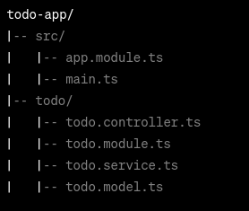

# NestJs practice

Let's create a basic example of a NestJS TODO API using MongoDB. Before you
proceed, make sure you have NestJS and MongoDB installed.

This example provides the basic CRUD operations for a TODO app. Customize it
further based on your requirements.

## App structure



## setup

1.  Install NestJs CLI:

    ```bash
    npm install -g @nestjs/cli
    ```

2.  Create a new NestJS project:

    ```bash
    nest new todo-app
    ```

3.  Install NecessaryJS packages:

    ```bash
    cd todo-app
    npm install @nestjs/mongoose mongoose
    ```

4.  Set up your MongoDB connection in src/app.module.ts:

## Code

```Typescript
// src/app.module.ts
import { Module } from '@nestjs/common';
import { MongooseModule } from '@nestjs/mongoose';
import { TodoModule } from './todo/todo.module';

@Module({
  imports: [
    MongooseModule.forRoot('mongodb://localhost/todo-app', { useNewUrlParser: true }),
    TodoModule,
  ],
})
export class AppModule {}
```

Note: Make sure to replace the connection string (mongodb://localhost/todo-app)
with your MongoDB server details.

5.  Create a Todo model in src/todo/todo.model.ts:

```Typescript
// src/todo/todo.model.ts
import { Prop, Schema, SchemaFactory } from '@nestjs/mongoose';
import { Document } from 'mongoose';

@Schema()
export class Todo extends Document {
  @Prop({ required: true })
  title: string;

  @Prop({ default: false })
  completed: boolean;
}

export const TodoSchema = SchemaFactory.createForClass(Todo);
```

6. Create a Todo service in src/todo/todo.service.ts:

```Typescript
import { Injectable } from '@nestjs/common';
import { Model } from 'mongoose';
import { InjectModel } from '@nestjs/mongoose';
import { Todo } from './todo.model';

@Injectable()
export class TodoService {
  constructor(@InjectModel(Todo.name) private todoModel: Model<Todo>) {}

  async findAll(): Promise<Todo[]> {
    return this.todoModel.find().exec();
  }

  async create(todo: Todo): Promise<Todo> {
    const createdTodo = new this.todoModel(todo);
    return createdTodo.save();
  }

  async findById(id: string): Promise<Todo> {
    return this.todoModel.findById(id).exec();
  }

  async update(id: string, todo: Todo): Promise<Todo> {
    return this.todoModel.findByIdAndUpdate(id, todo, { new: true }).exec();
  }

  async delete(id: string): Promise<Todo> {
    return this.todoModel.findByIdAndRemove(id).exec();
  }
}
```

7.  Create a Todo controller in src/todo/todo.controller.ts:

```Typescript
// src/todo/todo.controller.ts
import { Controller, Get, Post, Put, Delete, Param, Body } from '@nestjs/common';
import { TodoService } from './todo.service';
import { Todo } from './todo.model';

@Controller('todos')
export class TodoController {
  constructor(private readonly todoService: TodoService) {}

  @Get()
  findAll(): Promise<Todo[]> {
    return this.todoService.findAll();
  }

  @Post()
  create(@Body() todo: Todo): Promise<Todo> {
    return this.todoService.create(todo);
  }

  @Get(':id')
  findById(@Param('id') id: string): Promise<Todo> {
    return this.todoService.findById(id);
  }

  @Put(':id')
  update(@Param('id') id: string, @Body() todo: Todo): Promise<Todo> {
    return this.todoService.update(id, todo);
  }

  @Delete(':id')
  delete(@Param('id') id: string): Promise<Todo> {
    return this.todoService.delete(id);
  }
}

```

8. Register Todo service and controller in src/todo/todo.module.ts:

```Typescript
// src/todo/todo.module.ts
import { Module } from '@nestjs/common';
import { MongooseModule } from '@nestjs/mongoose';
import { TodoController } from './todo.controller';
import { TodoService } from './todo.service';
import { Todo, TodoSchema } from './todo.model';

@Module({
  imports: [MongooseModule.forFeature([{ name: Todo.name, schema: TodoSchema }])],
  controllers: [TodoController],
  providers: [TodoService],
})
export class TodoModule {}
```

Now, you have a basic NestJS TODO API with MongoDB. You can run the application
using:

```bash
npm run start
```

## Testing your application

You can use a tool like Postman to test your endpoints. Here are some example
requests:

- GET /todos: Get all todos
- POST /todos: Create a new todo
- GET /todos/:id: Get a todo by id
- PUT /todos/:id: Update a todo by id
- DELETE /todos/:id: Delete a todo by id

You can also use the MongoDB shell to verify that the data is being stored in
the database.
