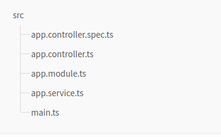

# Gettings started with NestJs

A robust framework works with a CLI environment to create a new project, modules, controllers, and services.

**Prerequisites**

Please make sure that Node.js (version >= 16) is installed on your operating system.

## SetUp

Setting up a new project is quite simple with the Nest CLI. With npm installed, you can create a new Nest project with the following commands in your OS terminal:

```bash
$ npm i -g @nestjs/cli
$ nest new my-nest-project
```

Hint: To create a new project with TypeScript's stricter feature set, pass the `--strict` flag to the `nest new` command.

The project-name directory will be created, node modules and a few other boilerplate files will be installed, and a `src/` directory will be created and populated with several core files.



Here's a brief overview of those core files:

- `app.controller.spec.ts`: The unit tests for the controller.
- `app.controller.ts`: A basic controller with a single route. It uses the x@xxxxxxxxxxx decorator to define the route prefix for all routes defined within the controller.
- `app.module.ts`: The root module of the application. It uses the x@xxxxxxx decorator to define the module's metadata.
- `app.service.ts`: A basic service with a single method. It is used by the controller to handle the incoming request.
- `main.ts`: The entry file of the application. It uses the `NestFactory` class to create an instance of the application.

## Running the application

To start the application, run the following command in your terminal:

```bash
$ npm run start
```
To watch for changes in your files, you can run the following command to start the application:

```bash
$ npm run start:dev
```

## Linting and formatting

NestJs uses ESLint and Prettier to enforce a consistent code style. You can run the following command to lint and format your code:

```bash
// Lint and autoFix with eslint
$ npm run lint

// Format with prettier
$ npm run format
```


