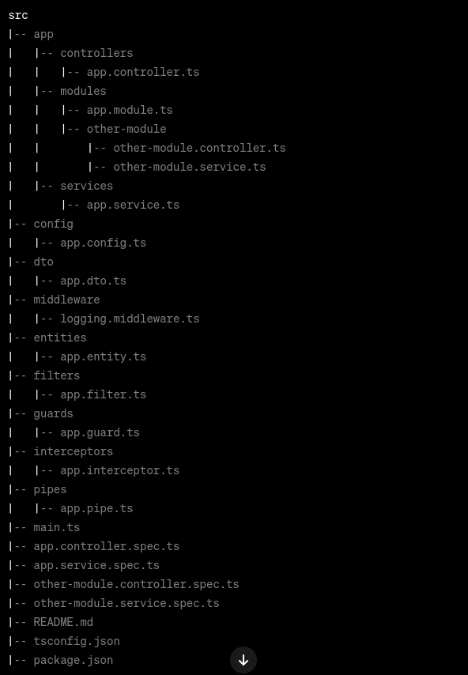

# Structuring Nestjs Projects: Best Practices and Example

NestJS is a framework for building scalable and maintainable server-side
applications using TypeScript. The structure might vary based on the specific
requirements of your project, but a well-organized project structure is crucial
for building robust and maintainable applications. In this guide, we’ll explore
the best practices for structuring NestJS projects.

Usually, NestJS architecture is based on the following features:

- Controllers
- Modules
- Services

All the above features are organized in a modular way. This means that a module
in NestJS serves as a container for organizing and encapsulating different parts
of your application



## Explanation:

- **src**: This is the main source code directory.
  - **app**: The main module of your application.
    - **controllers**: Controllers handle incoming requests and return
      responses.
    - **modules**: Different modules of your application. Each module can have
      its **controllers**, services, and other components.
    - **services**: Business logic and data manipulation are handled by
      services.
  - **config**: Configuration files for your application.
  - **dto**: Data Transfer Objects (DTOs) for defining the structure of data
    passed between different layers of your application.
  - **middleware**: Custom middleware for processing requests before they reach
    the controllers.
  - **entities**: Database entities or data models for interacting with
    databases.
  - **filters**: Custom exception filters for handling exceptions globally.
  - **guards**: Authorization guards for controlling access to routes.
  - **interceptors**: Interceptors can be used to modify the request/response
    objects globally.
  - **pipes**: Pipes are used to transform the data coming into the application.
- **main.ts**: The entry point of your application where you bootstrap NestJS.

- **app.controller.spec.ts, app.service.spec.ts, etc.**: Unit test files for
  your controllers, services, and other components.

- **README.md**: Documentation for your project.

- **tsconfig.json**: TypeScript configuration file.

- **package.json**: Node.js package file with dependencies and scripts.

## Let's see examples for each of these files based on an example project structure that handle the administration of a barber shop.

### 1. **src/app/controllers/app.controller.t**:

```typescript
import { Controller, Get } from "@nestjs/common";
import { AppService } from "../services/app.service";

@Controller("barber")
export class AppController {
  constructor(private readonly appService: AppService) {}

  @Get()
  getBarberShopInfo(): string {
    return this.appService.getBarberShopInfo();
  }
}
```

### 2. **src/app/modules/app.module.ts**:

```typescript
import { Module } from "@nestjs/common";
import { AppController } from "../controllers/app.controller";
import { AppService } from "../services/app.service";

@Module({
  controllers: [AppController],
  providers: [AppService],
})
export class AppModule {}
```

### 3. src/app/services/app.service.ts:

```typescript
import { Injectable } from "@nestjs/common";

@Injectable()
export class AppService {
  getBarberShopInfo(): string {
    return "Welcome to our Barber Shop!";
  }
}
```

### 4. **src/dto/app.dto.ts**:

```typescript
// src/dto/app.dto.ts

export class BarberInfoDto {
  name: string;
  address: string;
  // Add more properties as needed
}
```

### 5. **src/middleware/logging.middleware.ts**:

```typescript
import { Injectable, NestMiddleware } from "@nestjs/common";
import { Request, Response, NextFunction } from "express";

@Injectable()
export class LoggingMiddleware implements NestMiddleware {
  use(req: Request, res: Response, next: NextFunction) {
    console.log(`Request received at ${new Date()}`);
    next();
  }
}
```

This middleware logs the time of each incoming request. this means that the
request will be logged before it reaches the controllers.

### 6. **src/entities/barber.entity.ts**:

```typescript
import { Entity, Column, PrimaryGeneratedColumn } from "typeorm";

@Entity()
export class Barber {
  @PrimaryGeneratedColumn()
  id: number;

  @Column()
  name: string;

  @Column()
  address: string;
  // Add more columns as needed
}
```

### 7. **src/filters/http-exception.filter.ts**:

```typescript
import { ExceptionFilter, Catch, ArgumentsHost } from "@nestjs/common";
import { Request, Response } from "express";

@Catch(Error)
export class AppFilter implements ExceptionFilter {
  catch(exception: Error, host: ArgumentsHost) {
    const ctx = host.switchToHttp();
    const response = ctx.getResponse<Response>();
    const request = ctx.getRequest<Request>();

    response.status(500).json({
      statusCode: 500,
      message: "Internal Server Error",
      timestamp: new Date().toISOString(),
      path: request.url,
    });
  }
}
```

This filter accepts any exception and returns a 500 status code with a JSON.
This custom exception filter provides a centralized place to handle all uncaught
exceptions and to format the error response

### 8. **src/guards/auth.guard.ts**:

```typescript
import { Injectable, CanActivate, ExecutionContext } from "@nestjs/common";

@Injectable()
export class AppGuard implements CanActivate {
  canActivate(context: ExecutionContext): boolean {
    // Your authorization logic here
    return true;
  }
}
```

This guard is used to control access to routes. It can be used to implement
routes that require authentication or authorization.

### 9. **src/interceptors/transform.interceptor.ts**:

```typescript
import {
  Injectable,
  NestInterceptor,
  ExecutionContext,
  CallHandler,
} from "@nestjs/common";
import { Observable } from "rxjs";

@Injectable()
export class AppInterceptor implements NestInterceptor {
  intercept(context: ExecutionContext, next: CallHandler): Observable<any> {
    console.log("Before request is handled...");
    return next.handle();
  }
}
```

This interceptor logs a message before the request is handled. Interceptors can
be used to modify the request/response objects globally. In other words, they
can be used to modify the behavior of the request/response pipeline.
