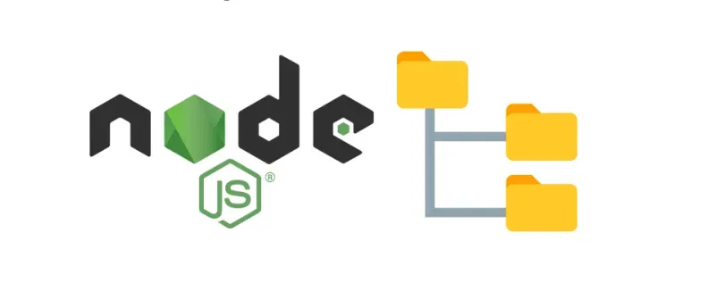
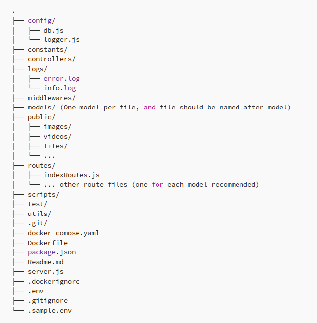

# Structuring Node.js Projects: Best Practices and Example

When it comes to building robust and maintainable Node.js applications, a well-organized project structure is crucial. A thoughtfully designed project structure enhances collaboration, simplifies maintenance, and contributes to the scalability of your application, in this guide we’ll explore the best practices for structuring Node.js projects and take a closer look at an example project structure available on GitHub.

You can find the project structure from [Node.js Starter Project](https://github.com/akshatgadodia/nodejs-starter).

## Why Project Structure Matters

1. Maintainability: A clear project structure makes it easier to locate and update different parts of your application. This is particularly important as your project grows.

2. Collaboration: When working in teams, a standardized structure helps team members understand where to find specific code and resources.

3. Scalability: A well-structured project can be easily extended without introducing unnecessary complexity.

## Directory and File Structure

Here’s a breakdown of the common components you might find in a well-structured Node.js project:

1. **config**: Store configuration files such as database configurations, API keys, and environment-specific settings.

2. **constants**: Define constants or enums that are used throughout your application.

3. **controllers**: Organize route handlers and logic that handle HTTP requests.

4. **logs**: Store log files generated by your application for debugging and monitoring.

5. **middlewares**: Implement middleware functions for tasks like authentication, input validation, and logging.

6. **models**: Define data models that interact with the database and encapsulate data logic.

7. **public**: Store static assets like images, stylesheets, and client-side JavaScript files.

8. **scripts**: Keep utility or automation scripts here, aiding in your development workflow.

9. **routes**: Define API endpoints and link them to the appropriate controllers.

10. **test**: Include a dedicated folder for tests, covering various aspects of your application.

11. **utils**: House utility functions or modules used across your application.

12. **docker-compose.yaml**: Define a multi-container Docker application, specifying services and dependencies.

13. **Dockerfile**: Build a Docker container image for your application.

14. **package.json**: Manage project metadata, dependencies, and scripts.

15. **Readme.md**: Document your project’s purpose, setup instructions, usage, and other relevant details.

16.** server.js**: Create the entry point of your application, setting up routes and starting the server.

17. **.dockerignore**: Exclude files from Docker images.

18. **.env and .sample.env**: Manage environment variables and provide sample values for newcomers.

19. **.git**: House Git-related information.

20. **.gitignore**: Specify files and directories to exclude from version control.

## Conclusion

A well-structured project is essential for building scalable, maintainable, and collaborative Node.js applications. By following best practices and maintaining a standardized project structure, you can streamline development, enhance maintainability, and improve the overall quality of your application.